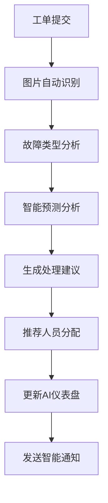

# 工单管理后台AI智能体功能增强方案

## 1. 产品概述

基于现有工单管理后台系统，集成AI智能体功能，提供智能预测、图片自动识别、智能决策等功能，提升工单处理效率和管理智能化水平。通过机器学习算法和计算机视觉技术，为管理员提供更智能的数据分析和决策支持。

## 2. 核心功能

### 2.1 用户角色

| 角色 | 注册方式 | 核心权限 |
|------|----------|----------|
| AI管理员 | 系统分配 | 可配置AI模型参数、查看AI分析报告、管理智能功能 |
| 工单管理员 | 账号升级 | 可使用AI预测功能、图片识别、智能推荐等功能 |
| 普通用户 | 基础注册 | 可查看AI生成的基础统计和预测结果 |

### 2.2 功能模块

我们的AI智能体增强方案包含以下主要页面：
1. **AI仪表盘页面**：智能数据分析、预测图表、AI洞察报告
2. **智能预测页面**：工单完成时间预测、资源需求预测、故障趋势预测
3. **图片识别页面**：工单图片自动分析、设备类型识别、故障类型识别
4. **智能推荐页面**：处理方案推荐、资源分配建议、优先级智能调整
5. **AI配置页面**：模型参数设置、识别规则配置、预测算法调优

### 2.3 页面详情

| 页面名称 | 模块名称 | 功能描述 |
|----------|----------|----------|
| AI仪表盘页面 | 智能数据分析 | 实时分析工单数据趋势，生成智能洞察报告，预测未来工单量 |
| AI仪表盘页面 | 预测图表展示 | 显示工单完成时间预测、资源需求预测等可视化图表 |
| AI仪表盘页面 | 异常检测 | 自动识别异常工单模式，提供预警和建议 |
| 智能预测页面 | 完成时间预测 | 基于历史数据预测工单完成时间，提供准确度评估 |
| 智能预测页面 | 资源需求预测 | 预测未来时间段的人力和物料需求，优化资源配置 |
| 智能预测页面 | 故障趋势分析 | 分析设备故障模式，预测潜在故障点和维护需求 |
| 图片识别页面 | 设备类型识别 | 自动识别工单图片中的设备类型，标注设备信息 |
| 图片识别页面 | 故障类型识别 | 分析故障图片，自动识别故障类型和严重程度 |
| 图片识别页面 | 施工进度识别 | 识别施工现场图片，自动评估施工进度和质量 |
| 智能推荐页面 | 处理方案推荐 | 基于相似工单历史，推荐最优处理方案和步骤 |
| 智能推荐页面 | 人员分配建议 | 根据工单特征和人员技能，智能推荐最适合的处理人员 |
| 智能推荐页面 | 优先级调整 | 基于紧急程度和影响范围，智能调整工单优先级 |
| AI配置页面 | 模型参数设置 | 配置预测模型参数、识别阈值、算法权重等 |
| AI配置页面 | 训练数据管理 | 管理训练数据集，标注样本数据，优化模型性能 |

## 3. 核心流程

### 3.1 AI管理员流程
AI管理员登录系统后，首先进入AI仪表盘查看整体智能分析结果，然后可以进入AI配置页面调整模型参数和训练数据，最后查看各项AI功能的运行状态和准确度报告。

### 3.2 工单管理员流程
工单管理员在处理工单时，可以使用图片识别功能自动分析工单图片，获取设备和故障信息，然后查看智能预测的完成时间和资源需求，最后根据智能推荐选择最优的处理方案和人员分配。

### 3.3 系统智能处理流程

## 4. 用户界面设计

### 4.1 设计风格
- **主色调**：科技蓝#1890FF，辅助色智能绿#52C41A
- **按钮样式**：现代扁平化设计，带有微妙阴影和渐变效果
- **字体**：主字体使用PingFang SC，代码字体使用Monaco，大小14px-16px
- **布局风格**：卡片式布局，左侧导航，顶部带有AI状态指示器
- **图标风格**：使用AI主题图标，包括机器人、大脑、预测等元素

### 4.2 页面设计概览

| 页面名称 | 模块名称 | UI元素 |
|----------|----------|--------|
| AI仪表盘页面 | 智能数据分析 | 深蓝色渐变背景，动态数据卡片，实时更新的预测图表，AI洞察气泡提示 |
| AI仪表盘页面 | 预测图表展示 | ECharts动态图表，智能绿色高亮，预测准确度进度条，趋势箭头指示器 |
| 智能预测页面 | 完成时间预测 | 时间轴组件，预测置信度显示，历史对比图表，智能建议卡片 |
| 图片识别页面 | 设备识别区域 | 拖拽上传区域，实时识别进度条，标注结果展示，置信度评分显示 |
| 智能推荐页面 | 推荐方案展示 | 推荐卡片列表，相似度评分，采纳率统计，智能排序功能 |
| AI配置页面 | 参数设置面板 | 滑块调节器，开关按钮，参数预览图表，模型性能监控面板 |

### 4.3 响应式设计
系统采用桌面优先设计，支持平板和大屏显示器适配，AI图表和数据可视化组件针对不同屏幕尺寸进行优化显示。