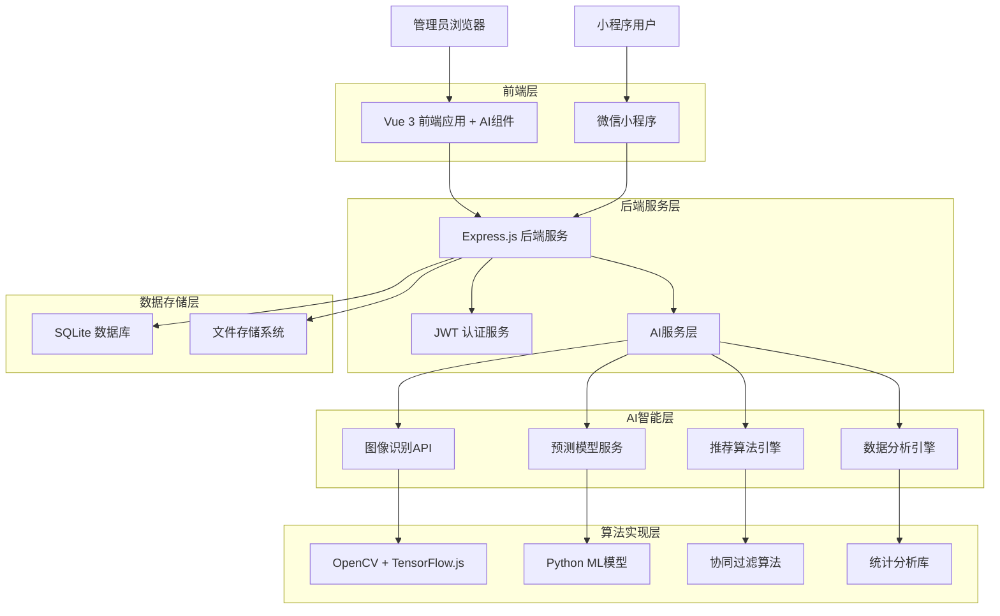
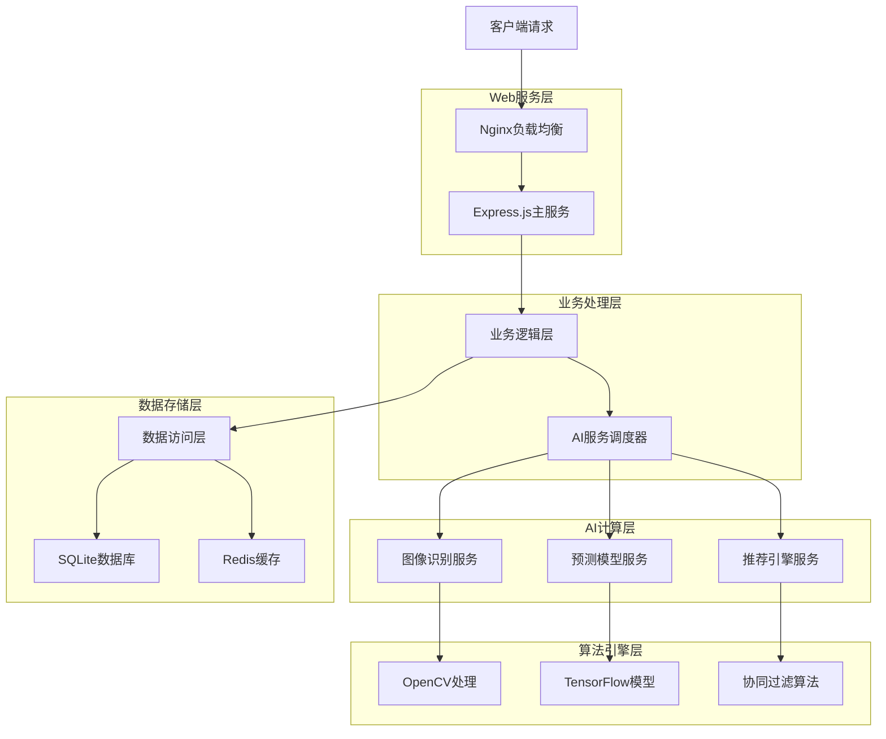
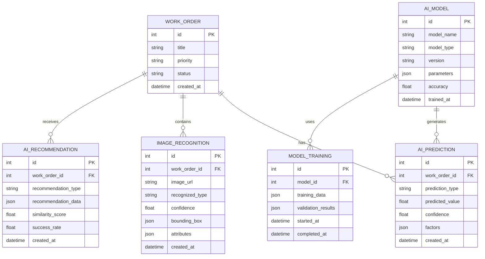

# 工单管理后台AI智能体技术架构文档

## 1. 架构设计



## 2. 技术描述

基于现有Node.js技术栈，集成AI智能功能：

- Frontend: Vue@3 + Element Plus + ECharts + TensorFlow.js
- Backend: Node.js + Express@4 + Python Flask (AI服务)
- Database: SQLite + Redis (缓存)
- AI Framework: TensorFlow.js + OpenCV.js + Python scikit-learn
- Image Processing: Sharp + Canvas API
- Real-time: Socket.io (实时AI分析推送)

## 3. 路由定义

| 路由 | 功能 |
|------|------|
| /ai-dashboard | AI智能仪表盘，显示预测分析和智能洞察 |
| /ai-prediction | 智能预测页面，工单完成时间和资源需求预测 |
| /ai-recognition | 图片识别页面，设备和故障自动识别 |
| /ai-recommendation | 智能推荐页面，处理方案和人员分配建议 |
| /ai-config | AI配置页面，模型参数和训练数据管理 |
| /ai-analytics | AI分析报告页面，模型性能和准确度统计 |

## 4. API定义

### 4.1 AI预测服务API

#### 工单完成时间预测
```
POST /api/ai/predict/completion-time
```

请求参数:
| 参数名 | 参数类型 | 是否必填 | 描述 |
|--------|----------|----------|------|
| workOrderId | number | true | 工单ID |
| priority | string | true | 优先级 |
| constructionStage | string | true | 施工阶段 |
| complexity | number | false | 复杂度评分 |

响应数据:
| 参数名 | 参数类型 | 描述 |
|--------|----------|------|
| predictedHours | number | 预测完成小时数 |
| confidence | number | 预测置信度(0-1) |
| factors | array | 影响因素分析 |

示例:
```json
{
  "predictedHours": 24.5,
  "confidence": 0.85,
  "factors": [
    {"factor": "priority", "impact": 0.3},
    {"factor": "complexity", "impact": 0.5}
  ]
}
```

### 4.2 图像识别API

#### 设备类型识别
```
POST /api/ai/recognition/equipment
```

请求参数:
| 参数名 | 参数类型 | 是否必填 | 描述 |
|--------|----------|----------|------|
| image | file | true | 图片文件 |
| workOrderId | number | true | 关联工单ID |

响应数据:
| 参数名 | 参数类型 | 描述 |
|--------|----------|------|
| equipmentType | string | 识别的设备类型 |
| confidence | number | 识别置信度 |
| boundingBox | object | 设备位置坐标 |
| attributes | array | 设备属性信息 |

### 4.3 智能推荐API

#### 处理方案推荐
```
POST /api/ai/recommend/solution
```

请求参数:
| 参数名 | 参数类型 | 是否必填 | 描述 |
|--------|----------|----------|------|
| workOrderId | number | true | 工单ID |
| problemType | string | true | 问题类型 |
| urgency | string | true | 紧急程度 |

响应数据:
| 参数名 | 参数类型 | 描述 |
|--------|----------|------|
| recommendations | array | 推荐方案列表 |
| similarity | number | 相似度评分 |
| successRate | number | 历史成功率 |

## 5. 服务器架构图



## 6. 数据模型

### 6.1 数据模型定义



### 6.2 数据定义语言

#### AI预测表 (ai_predictions)
```sql
CREATE TABLE ai_predictions (
    id INTEGER PRIMARY KEY AUTOINCREMENT,
    work_order_id INTEGER NOT NULL,
    prediction_type VARCHAR(50) NOT NULL,
    predicted_value REAL NOT NULL,
    confidence REAL NOT NULL,
    factors TEXT, -- JSON格式存储影响因素
    created_at DATETIME DEFAULT CURRENT_TIMESTAMP,
    FOREIGN KEY (work_order_id) REFERENCES work_orders(id)
);

-- 创建索引
CREATE INDEX idx_ai_predictions_work_order ON ai_predictions(work_order_id);
CREATE INDEX idx_ai_predictions_type ON ai_predictions(prediction_type);
CREATE INDEX idx_ai_predictions_created ON ai_predictions(created_at DESC);
```

#### 图像识别表 (image_recognitions)
```sql
CREATE TABLE image_recognitions (
    id INTEGER PRIMARY KEY AUTOINCREMENT,
    work_order_id INTEGER NOT NULL,
    image_url VARCHAR(500) NOT NULL,
    recognized_type VARCHAR(100),
    confidence REAL NOT NULL,
    bounding_box TEXT, -- JSON格式存储坐标
    attributes TEXT, -- JSON格式存储属性
    processing_time INTEGER, -- 处理时间(毫秒)
    created_at DATETIME DEFAULT CURRENT_TIMESTAMP,
    FOREIGN KEY (work_order_id) REFERENCES work_orders(id)
);

-- 创建索引
CREATE INDEX idx_image_recognitions_work_order ON image_recognitions(work_order_id);
CREATE INDEX idx_image_recognitions_type ON image_recognitions(recognized_type);
```

#### AI推荐表 (ai_recommendations)
```sql
CREATE TABLE ai_recommendations (
    id INTEGER PRIMARY KEY AUTOINCREMENT,
    work_order_id INTEGER NOT NULL,
    recommendation_type VARCHAR(50) NOT NULL,
    recommendation_data TEXT NOT NULL, -- JSON格式存储推荐内容
    similarity_score REAL,
    success_rate REAL,
    is_adopted BOOLEAN DEFAULT FALSE,
    adopted_at DATETIME,
    created_at DATETIME DEFAULT CURRENT_TIMESTAMP,
    FOREIGN KEY (work_order_id) REFERENCES work_orders(id)
);

-- 创建索引
CREATE INDEX idx_ai_recommendations_work_order ON ai_recommendations(work_order_id);
CREATE INDEX idx_ai_recommendations_type ON ai_recommendations(recommendation_type);
CREATE INDEX idx_ai_recommendations_adopted ON ai_recommendations(is_adopted);
```

#### AI模型表 (ai_models)
```sql
CREATE TABLE ai_models (
    id INTEGER PRIMARY KEY AUTOINCREMENT,
    model_name VARCHAR(100) NOT NULL,
    model_type VARCHAR(50) NOT NULL, -- 'prediction', 'recognition', 'recommendation'
    version VARCHAR(20) NOT NULL,
    parameters TEXT, -- JSON格式存储模型参数
    accuracy REAL,
    status VARCHAR(20) DEFAULT 'active', -- 'active', 'training', 'deprecated'
    trained_at DATETIME,
    created_at DATETIME DEFAULT CURRENT_TIMESTAMP,
    updated_at DATETIME DEFAULT CURRENT_TIMESTAMP
);

-- 初始化数据
INSERT INTO ai_models (model_name, model_type, version, parameters, accuracy) VALUES
('completion_time_predictor', 'prediction', '1.0', '{"algorithm": "random_forest", "features": ["priority", "stage", "complexity"]}', 0.85),
('equipment_classifier', 'recognition', '1.0', '{"architecture": "cnn", "input_size": [224, 224, 3]}', 0.92),
('solution_recommender', 'recommendation', '1.0', '{"algorithm": "collaborative_filtering", "similarity_metric": "cosine"}', 0.78);
```

#### 模型训练记录表 (model_training_logs)
```sql
CREATE TABLE model_training_logs (
    id INTEGER PRIMARY KEY AUTOINCREMENT,
    model_id INTEGER NOT NULL,
    training_data_size INTEGER,
    validation_accuracy REAL,
    training_loss REAL,
    validation_loss REAL,
    training_time INTEGER, -- 训练时间(秒)
    hyperparameters TEXT, -- JSON格式存储超参数
    started_at DATETIME NOT NULL,
    completed_at DATETIME,
    status VARCHAR(20) DEFAULT 'running', -- 'running', 'completed', 'failed'
    FOREIGN KEY (model_id) REFERENCES ai_models(id)
);

-- 创建索引
CREATE INDEX idx_training_logs_model ON model_training_logs(model_id);
CREATE INDEX idx_training_logs_status ON model_training_logs(status);
CREATE INDEX idx_training_logs_started ON model_training_logs(started_at DESC);
```