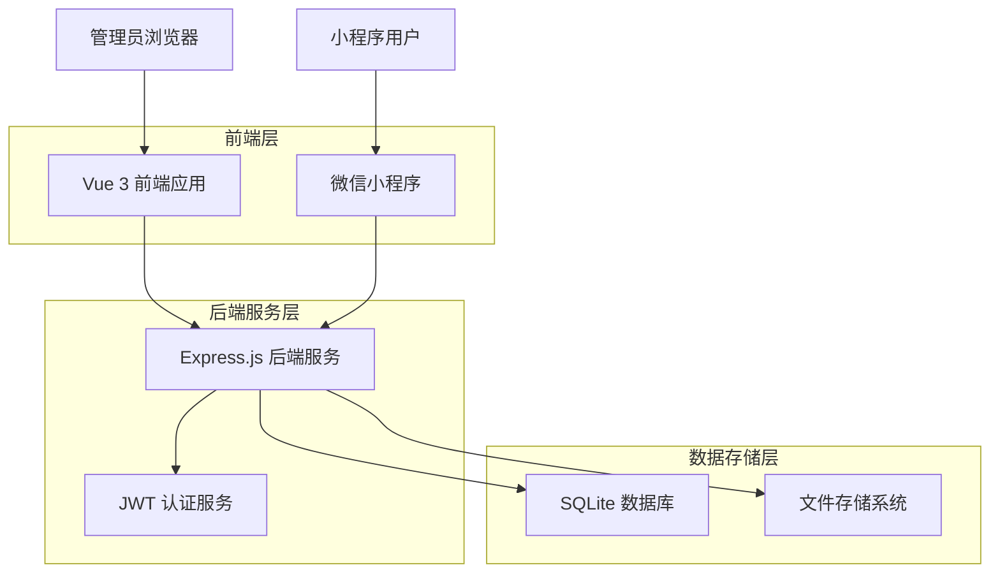
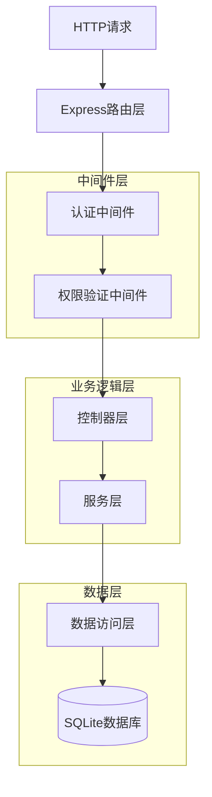
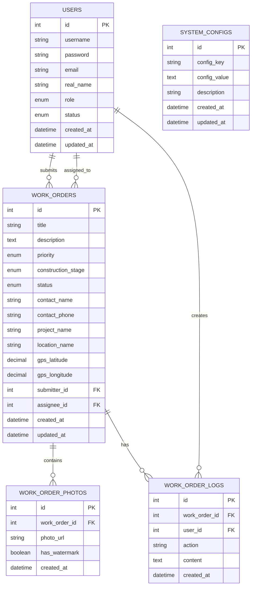
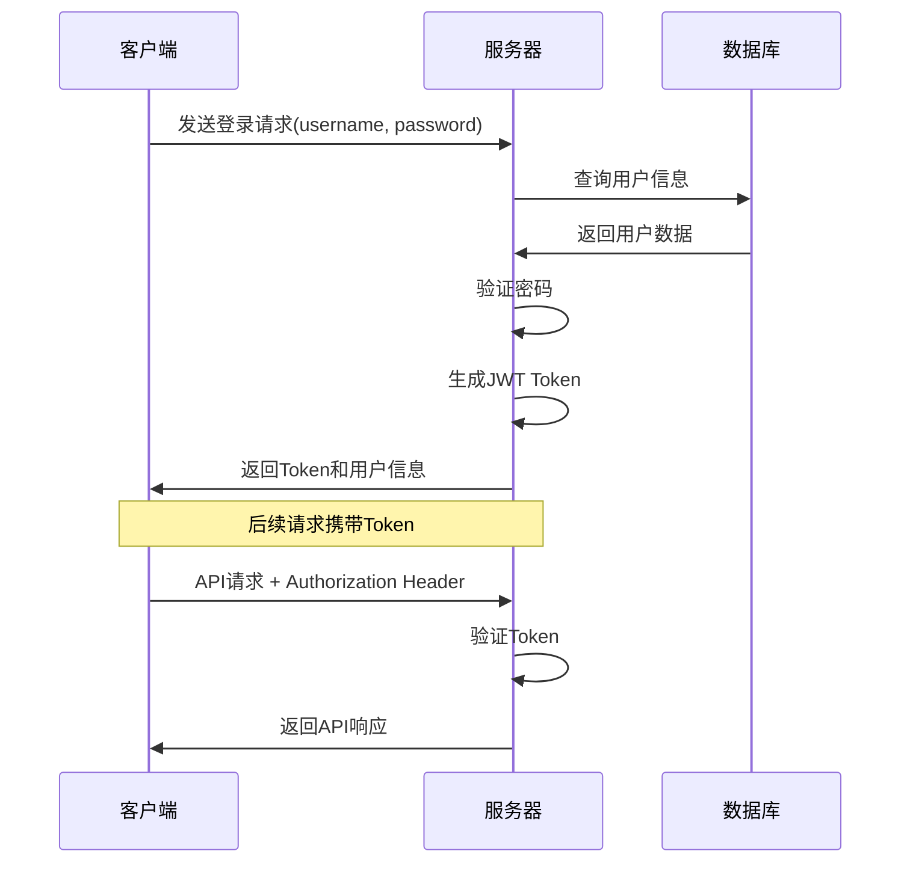

# 工单管理后台技术架构文档

## 1. 架构设计



## 2. 技术描述

基于用户本地Node.js和Python3环境，选择最方便部署的技术栈：

**方案一：Node.js全栈方案（推荐）**
- Frontend: Vue@3 + Element Plus + Vite
- Backend: Node.js + Express@4 + SQLite3
- Database: SQLite（文件数据库，无需安装）
- 工具: nodemon（开发热重载）

**方案二：Python后端方案**
- Frontend: Vue@3 + Element Plus + Vite
- Backend: Python + Flask + SQLite3
- Database: SQLite（文件数据库，无需安装）
- 工具: Flask-CORS（跨域支持）

## 3. 路由定义

### 3.1 前端路由

| 路由 | 页面功能 | 权限要求 |
|------|----------|----------|
| /login | 登录页面 | 公开访问 |
| /dashboard | 仪表盘首页 | 需要登录 |
| /work-orders | 工单列表页 | 需要登录 |
| /work-orders/:id | 工单详情页 | 需要登录 |
| /users | 用户管理页 | 管理员权限 |
| /statistics | 数据统计页 | 需要登录 |
| /settings | 系统设置页 | 管理员权限 |

### 3.2 后端API路由

| 路由 | 方法 | 功能描述 |
|------|------|----------|
| /api/auth/login | POST | 用户登录认证 |
| /api/auth/logout | POST | 用户登出 |
| /api/work-orders | GET | 获取工单列表 |
| /api/work-orders/:id | GET | 获取工单详情 |
| /api/users | GET | 获取用户列表 |
| /api/statistics/dashboard | GET | 获取仪表盘数据 |

## 4. API定义

### 4.1 认证相关API

#### 用户登录
```
POST /api/auth/login
```

请求参数:
| 参数名 | 类型 | 必填 | 描述 |
|--------|------|------|------|
| username | string | true | 用户名 |
| password | string | true | 密码 |

响应数据:
| 参数名 | 类型 | 描述 |
|--------|------|------|
| success | boolean | 请求是否成功 |
| token | string | JWT认证令牌 |
| user | object | 用户信息 |

示例:
```json
{
  "success": true,
  "token": "eyJhbGciOiJIUzI1NiIsInR5cCI6IkpXVCJ9...",
  "user": {
    "id": 1,
    "username": "admin",
    "role": "admin",
    "real_name": "管理员"
  }
}
```

### 4.2 工单管理API

#### 获取工单列表
```
GET /api/work-orders
```

查询参数:
| 参数名 | 类型 | 必填 | 描述 |
|--------|------|------|------|
| page | number | false | 页码，默认1 |
| limit | number | false | 每页数量，默认10 |
| status | string | false | 工单状态筛选 |
| priority | string | false | 优先级筛选 |
| stage | string | false | 施工阶段筛选 |
| keyword | string | false | 关键词搜索 |

响应数据:
```json
{
  "success": true,
  "data": {
    "list": [
      {
        "id": 1,
        "title": "设备故障报修",
        "priority": "high",
        "status": "pending",
        "construction_stage": "equipment",
        "created_at": "2024-01-15T10:30:00Z"
      }
    ],
    "total": 50,
    "page": 1,
    "limit": 10
  }
}
```

#### 更新工单状态
```
PUT /api/work-orders/:id/status
```

请求参数:
| 参数名 | 类型 | 必填 | 描述 |
|--------|------|------|------|
| status | string | true | 新状态值 |
| remark | string | false | 备注信息 |

### 4.3 统计分析API

#### 获取仪表盘数据
```
GET /api/statistics/dashboard
```

响应数据:
```json
{
  "success": true,
  "data": {
    "summary": {
      "total_orders": 156,
      "pending_orders": 23,
      "processing_orders": 45,
      "completed_orders": 88
    },
    "stage_distribution": {
      "preparation": 12,
      "foundation": 25,
      "structure": 34,
      "decoration": 28,
      "equipment": 31,
      "completion": 26
    },
    "priority_distribution": {
      "low": 45,
      "medium": 67,
      "high": 32,
      "urgent": 12
    }
  }
}
```

## 5. 服务器架构图



## 6. 数据模型

### 6.1 数据模型关系图



### 6.2 数据定义语言

#### 用户表
```sql
CREATE TABLE users (
    id INTEGER PRIMARY KEY AUTOINCREMENT,
    username VARCHAR(50) UNIQUE NOT NULL,
    email VARCHAR(100),
    real_name VARCHAR(50),
    role TEXT CHECK(role IN ('admin', 'manager', 'user')) DEFAULT 'user',
    status TEXT CHECK(status IN ('active', 'inactive')) DEFAULT 'active',
    created_at DATETIME DEFAULT CURRENT_TIMESTAMP,
    updated_at DATETIME DEFAULT CURRENT_TIMESTAMP
);

-- 创建索引
CREATE INDEX idx_users_username ON users(username);
CREATE INDEX idx_users_role ON users(role);
CREATE INDEX idx_users_status ON users(status);

-- 初始化数据
INSERT INTO users (username, password, email, real_name, role) VALUES 
('admin', '$2b$10$hash...', 'admin@example.com', '系统管理员', 'admin'),
('manager', '$2b$10$hash...', 'manager@example.com', '工单管理员', 'manager');

INSERT INTO work_orders (title, description, priority, construction_stage, contact_name, contact_phone, location_name, status, submitter_id) VALUES 
('测试工单1', '这是一个测试工单', 'high', 'preparation', '张三', '13800138000', '北京市朝阳区', 'pending', 1),
('测试工单2', '另一个测试工单', 'medium', 'foundation', '李四', '13900139000', '上海市浦东新区', 'processing', 2);
```

## 7. 部署方案

### 7.1 快速部署步骤

**Node.js方案（推荐）**
```bash
# 1. 克隆项目
git clone <project-repo>
cd work-order-backend

# 2. 安装依赖
npm install

# 3. 初始化数据库
npm run init-db

# 4. 启动开发服务器
npm run dev
```

**Python方案**
```bash
# 1. 克隆项目
git clone <project-repo>
cd work-order-backend

# 2. 创建虚拟环境
python3 -m venv venv
source venv/bin/activate  # Windows: venv\Scripts\activate

# 3. 安装依赖
pip install -r requirements.txt

# 4. 初始化数据库
python init_db.py

# 5. 启动开发服务器
python app.py
```

### 7.2 一键启动脚本

**start.sh (macOS/Linux)**
```bash
#!/bin/bash
echo "启动工单管理后台系统..."

# 检查Node.js环境
if command -v node &> /dev/null; then
    echo "使用Node.js方案启动"
    cd backend && npm install && npm run dev &
    cd frontend && npm install && npm run dev &
else
    echo "使用Python方案启动"
    cd backend && python3 -m venv venv && source venv/bin/activate && pip install -r requirements.txt && python app.py &
    cd frontend && npm install && npm run dev &
fi

echo "系统启动完成！"
echo "前端地址: http://localhost:3000"
echo "后端地址: http://localhost:8000"
```

**start.bat (Windows)**
```batch
@echo off
echo 启动工单管理后台系统...

where node >nul 2>nul
if %ERRORLEVEL% EQU 0 (
    echo 使用Node.js方案启动
    cd backend && npm install && start npm run dev
    cd ../frontend && npm install && start npm run dev
) else (
    echo 使用Python方案启动
    cd backend && python -m venv venv && venv\Scripts\activate && pip install -r requirements.txt && start python app.py
    cd ../frontend && npm install && start npm run dev
)

echo 系统启动完成！
echo 前端地址: http://localhost:3000
echo 后端地址: http://localhost:8000
pause
```

### 7.3 项目结构
```
work-order-system/
├── frontend/          # Vue前端项目
│   ├── src/
│   ├── package.json
│   └── vite.config.js
├── backend/           # 后端项目
│   ├── app.js         # Node.js入口 或 app.py Python入口
│   ├── package.json   # Node.js依赖 或 requirements.txt Python依赖
│   ├── database.db    # SQLite数据库文件
│   └── uploads/       # 文件上传目录
├── start.sh           # 一键启动脚本(Unix)
├── start.bat          # 一键启动脚本(Windows)
└── README.md          # 部署说明
```

#### 工单表
```sql
CREATE TABLE work_orders (
    id INTEGER PRIMARY KEY AUTOINCREMENT,
    title VARCHAR(200) NOT NULL,
    description TEXT NOT NULL,
    priority TEXT CHECK(priority IN ('low', 'medium', 'high', 'urgent')) DEFAULT 'medium',
    construction_stage TEXT CHECK(construction_stage IN ('preparation', 'foundation', 'structure', 'decoration', 'equipment', 'completion')) NOT NULL,
    status TEXT CHECK(status IN ('pending', 'processing', 'completed', 'closed')) DEFAULT 'pending',
    contact_name VARCHAR(50),
    contact_phone VARCHAR(20),
    project_name VARCHAR(100),
    location_name VARCHAR(200),
    gps_latitude DECIMAL(10, 8),
    gps_longitude DECIMAL(11, 8),
    submitter_id INTEGER,
    assignee_id INTEGER,
    created_at DATETIME DEFAULT CURRENT_TIMESTAMP,
    updated_at DATETIME DEFAULT CURRENT_TIMESTAMP,
    FOREIGN KEY (submitter_id) REFERENCES users(id),
    FOREIGN KEY (assignee_id) REFERENCES users(id)
);

-- 创建索引
CREATE INDEX idx_work_orders_status ON work_orders(status);
CREATE INDEX idx_work_orders_priority ON work_orders(priority);
CREATE INDEX idx_work_orders_stage ON work_orders(construction_stage);
CREATE INDEX idx_work_orders_created_at ON work_orders(created_at DESC);
CREATE INDEX idx_work_orders_assignee ON work_orders(assignee_id);
```

#### 工单照片表
```sql
CREATE TABLE work_order_photos (
    id INTEGER PRIMARY KEY AUTOINCREMENT,
    work_order_id INTEGER NOT NULL,
    photo_url VARCHAR(500) NOT NULL,
    has_watermark BOOLEAN DEFAULT FALSE,
    created_at DATETIME DEFAULT CURRENT_TIMESTAMP,
    FOREIGN KEY (work_order_id) REFERENCES work_orders(id) ON DELETE CASCADE
);

-- 创建索引
CREATE INDEX idx_work_order_photos_order_id ON work_order_photos(work_order_id);
```

#### 工单日志表
```sql
CREATE TABLE work_order_logs (
    id INTEGER PRIMARY KEY AUTOINCREMENT,
    work_order_id INTEGER NOT NULL,
    user_id INTEGER NOT NULL,
    action VARCHAR(50) NOT NULL,
    content TEXT,
    created_at DATETIME DEFAULT CURRENT_TIMESTAMP,
    FOREIGN KEY (work_order_id) REFERENCES work_orders(id) ON DELETE CASCADE,
    FOREIGN KEY (user_id) REFERENCES users(id)
);

-- 创建索引
CREATE INDEX idx_work_order_logs_order_id ON work_order_logs(work_order_id);
CREATE INDEX idx_work_order_logs_created_at ON work_order_logs(created_at DESC);
```

#### 系统配置表
```sql
CREATE TABLE system_configs (
    id INTEGER PRIMARY KEY AUTOINCREMENT,
    config_key VARCHAR(100) UNIQUE NOT NULL,
    config_value TEXT,
    description VARCHAR(200),
    created_at DATETIME DEFAULT CURRENT_TIMESTAMP,
    updated_at DATETIME DEFAULT CURRENT_TIMESTAMP
);

-- 创建索引
CREATE INDEX idx_system_configs_key ON system_configs(config_key);

-- 初始化配置数据
INSERT INTO system_configs (config_key, config_value, description) VALUES 
('system_name', '工单管理系统', '系统名称'),
('max_photo_size', '5242880', '最大照片大小（字节）'),
('max_photos_per_order', '9', '每个工单最大照片数量');
```

## 7. 安全架构

### 7.1 认证流程


### 7.2 权限控制
- **路由级权限**: 前端路由守卫检查用户角色
- **API级权限**: 后端中间件验证接口访问权限
- **数据级权限**: 根据用户角色过滤数据范围

## 8. 性能优化

### 8.1 数据库优化
- 合理创建索引提升查询性能
- 分页查询避免大数据量加载
- 使用连接池管理数据库连接

### 8.2 前端优化
- 路由懒加载减少初始包大小
- 组件按需引入
- 图片懒加载和压缩
- 接口数据缓存

### 8.3 后端优化
- API响应数据压缩
- 静态资源缓存
- 请求日志记录
- 错误统一处理

## 9. 部署架构

### 9.1 开发环境
```
前端: http://localhost:3000 (Vite Dev Server)
后端: http://localhost:8080 (Express Server)
数据库: ./database/workorder.db (SQLite文件)
```

### 9.2 生产环境
```
前端: Nginx静态文件服务
后端: PM2进程管理 + Node.js
数据库: SQLite文件 + 定期备份
反向代理: Nginx
```

## 10. 监控和日志

### 10.1 日志系统
- 访问日志: 记录所有API请求
- 错误日志: 记录系统异常和错误
- 业务日志: 记录关键业务操作

### 10.2 监控指标
- 系统性能监控
- API响应时间统计
- 错误率监控
- 用户活跃度统计